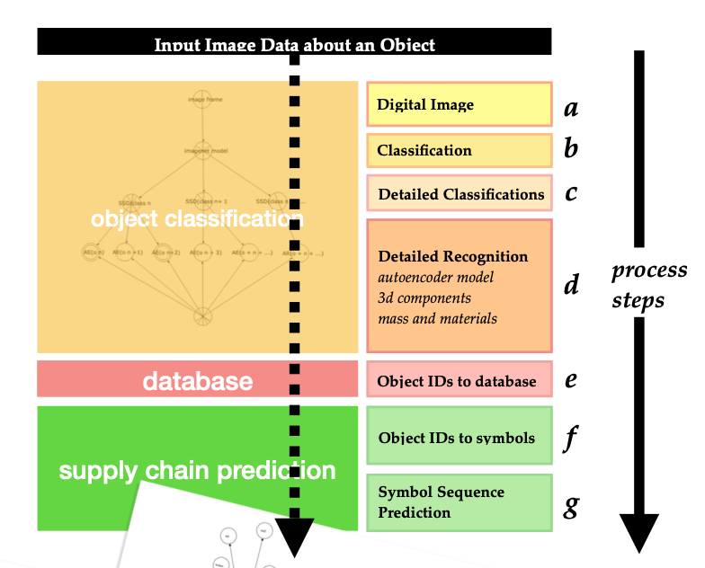
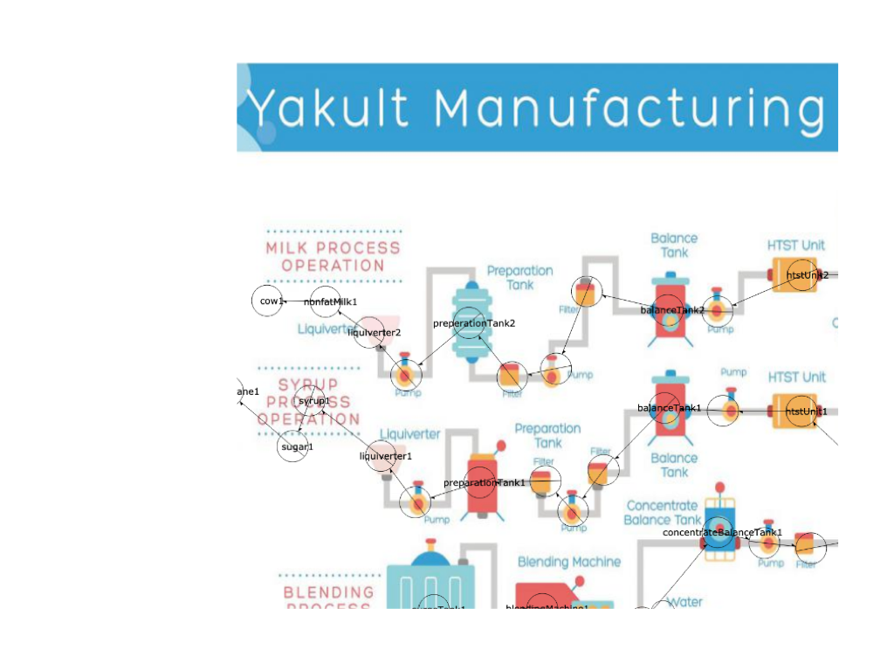
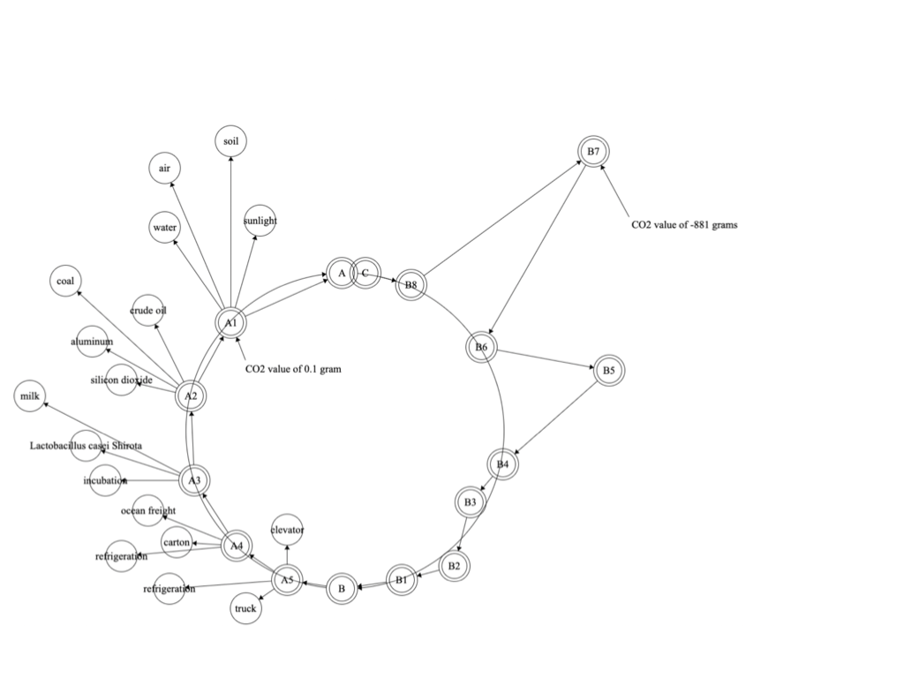
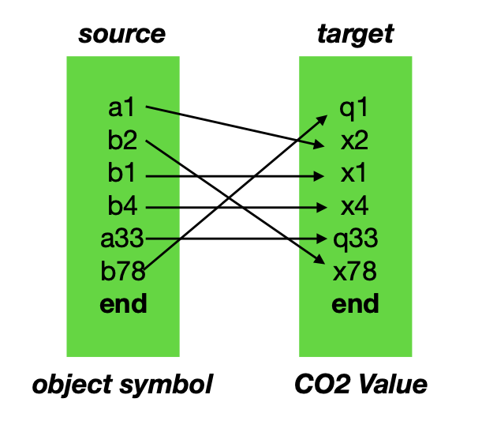

# CO2 CVM Carbon Chain Project

This repository archives and reconstructs an undergraduate research project on
predicting product-level carbon chains from object data.

The project explored how to connect computer vision, production-chain graphs,
and sequence-to-sequence modeling to estimate carbon values for physical
objects. The central idea was to represent an object's supply and disposal
chain as a Circularity Accounting Model / CVM graph, encode that graph as
symbol sequences, and train a model to map object or production-chain symbols
to carbon-value sequences.

## Reconstructed Goal

Given a product or object, the system aimed to:

1. Identify the object and its components from image or metadata.
2. Reconstruct the object's production chain, including materials, machines,
   intermediate objects, and distribution steps.
3. Encode the production chain as symbolic source sequences.
4. Use a seq2seq model to predict target sequences representing carbon values
   or carbon-flow information.
5. Provide the resulting carbon-chain estimate to an application interface for
   carbon-emission estimation and decision support.

## Pipeline

```text
input image / object description
-> image classification or object detection
-> component, material, and machine recognition
-> object IDs in a database / model card
-> symbolic production-chain representation
-> seq2seq model for CVM / carbon value prediction
-> carbon-chain estimate for user-facing tools
```

## Visual Walkthrough

### 1. System Structure



The original design starts with image data about an object. The object passes
through classification, detailed recognition, database lookup, conversion from
object IDs to symbols, and finally symbol-sequence prediction. This diagram is
the clearest overview of the project structure.

### 2. Production-Chain Reconstruction



One example reconstructed a Yakult manufacturing process from a production
diagram. Nodes represent materials, machines, tanks, pumps, filters, and
intermediate production steps. The goal was to turn a product diagram into a
structured production network.

### 3. CVM / Carbon-Value Representation



The reconstructed production network could then be represented as a CVM /
Circularity Accounting Model graph. In this representation, product inputs,
process steps, and CO2 values become connected nodes in a carbon-chain model.

### 4. Training Data for Seq2Seq Prediction



The training representation followed a seq2seq pattern: source-side object or
production-chain symbols were mapped to target-side CO2 values or carbon-flow
symbols. This matches the recovered server-side dataset names:

```text
sources.txt
targets.txt
vocab.sources.txt
vocab.targets.txt
```

## Original Project Concepts

- CO2 sequestration networks and vectors
- Circularity Accounting Model / CVM
- Consumption vectors
- Supply-chain and disposal-chain encoding
- Object IDs to symbols
- Symbol sequence prediction
- Source-to-target sequence mapping
- Carbon-flow and carbon-value estimation

## Examples in the Notes

The original notes include two main example domains:

- Blue jeans: denim, dye, zipper, buttons, sewing machines, cutting machines,
  pressing machines, and related production steps.
- Yakult manufacturing: milk, sugar, water, tanks, filters, pumps,
  homogenizers, packaging, storage, and distribution.

## Recovered Materials

- `docs/originals/co2_web_design.docx`: original Word export with project notes.
- `docs/originals/co2_web_design.pages`: original Pages document.
- `docs/originals/CO2-CV.pages`: later Pages note summarizing the machine
  learning direction.
- `assets/figures/`: extracted diagrams and document previews.
- `docs/notes/project-reconstruction.md`: a reconstructed explanation of what
  the project was doing.

## Historical Context

The recovered terminal screenshots suggest that training data was once stored
on a university-network-accessible server under a path similar to:

```text
~/2022s2s/seq2seq/nmt_data/CVM/train
```

The files shown in the screenshot included:

```text
sources.txt
targets.txt
vocab.sources.txt
vocab.targets.txt
original_source.txt
original_targets.txt
```

Those data files are not included here because the server required access to
the undergraduate university network and the original notes did not contain the
full dataset.

## Status

This repository is an archival reconstruction rather than a runnable training
pipeline. It preserves the project documents, diagrams, and inferred system
design so the work can be referenced, extended, or rewritten in a modern form.
